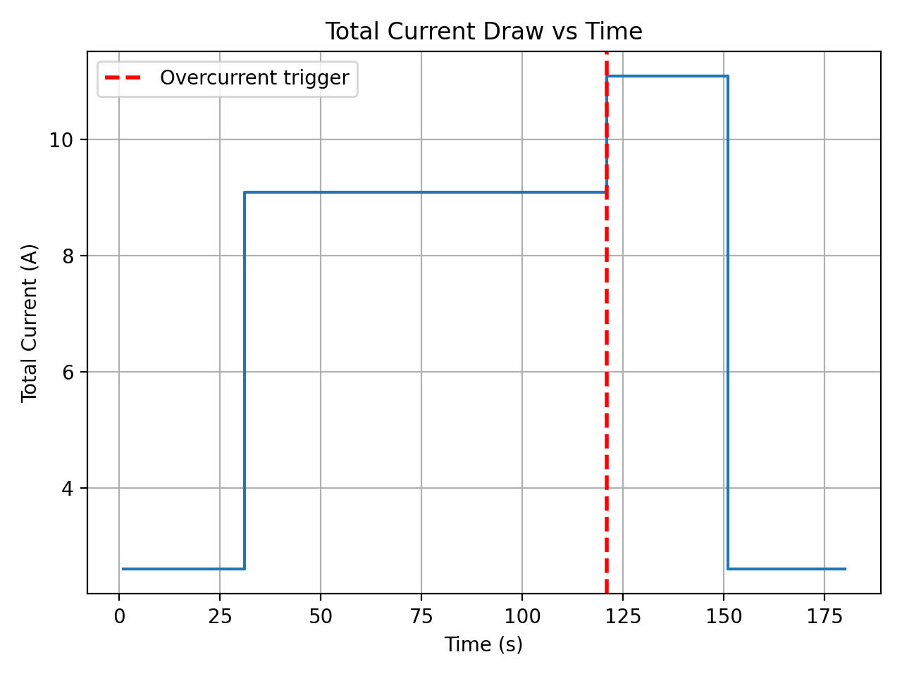

# RoboSub Power & Load Simulator (Indirect Project)

This repo contains a small power and battery-life simulator for an autonomous underwater robot (RoboSub-style).
The goal is to build systems intuition (power draw, mission phases, safety margins) and later connect this thinking
to a ROS2-based embedded autonomy project.

## What this sim does (v0)
- Models a battery (voltage, capacity in Ah)
- Models one or more loads with different mission states (idle / active)
- Simulates battery drain over time based on current draw
- Outputs remaining capacity and estimated runtime

## Project Structure
- `src/` – simulator code
- `logs/` – generated CSV logs (ignored by git)
- `reports/` – generated plots (ignored by git)

## How to run
```bash
python3 src/power_sim_v0.py

## Example Outputs

**Total Current vs Time (with Safety Trigger)**  
Dashed red line indicates first overcurrent detection during a high-load maneuver phase.



